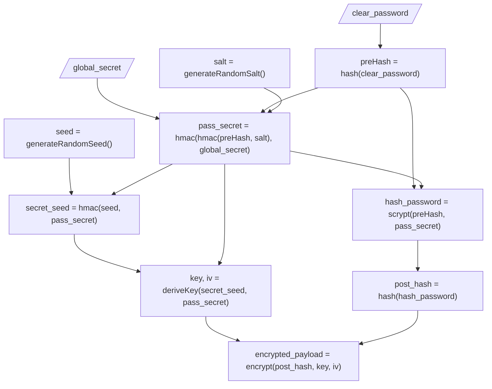

# ExPass

A secure password hashing/encription library for node and JavaScript.

> **WARNING**: This document refers to the whole project, for specific node
> implementation see the
> [@expass/node](https://www.npmjs.com/package/@expass/node) package.

## Features:

* Pre-hash password
* Use scrypt for anti-paralelization
* Use simetric encryption for storing the password
* Use global secret (a.k.a. pepper) for extra security
* Algorithms can be replaced by custom ones
* Wole library can be re-implemented 

## Installation

For node implementatio:

```bash
npm install @expass/node
```

> Future implementations will be available for browser and other platforms.

## Usage

```JavaScript
import { ExPass } from '@expass/node';

const SECRET = 'Q6I1BIPZhTbd6G7XjVedePfUV3TllC';

(async () => {
    const expass = new ExPass(SECRET);

    const password = 'my_password';

    const encrypted = await expass.encode(password);
    // $expass$UUJpNU11MUxuNGd...

    const isValid = await expass.compare(password, encrypted);
)();
```

For more information, see the documentation _(@TODO)_.

## Customization

You can replace the algorithms used by the library, or even implement your own
algorithms.

```JavaScript

import { ExPass } from '@expass/node';

const SECRET = 'Q6I1BIPZhTbd6G7XjVedePfUV3TllC';

(async () => {
    const expass = new ExPass(SECRET, {
        power: 14,
        saltLength: 32,
    });

    const password = 'my_password';

    const encrypted = await expass.encode(password);
    // $expass$UUJpNU11MUxuNGd...

    const isValid = await expass.verify(password, encrypted);
)();
```

The options are:

| Option             | Type   | Description                                         | Default   |
| ------             | ----   | -----------                                         | -------   |
| power              | number | The power of the scrypt algorithm                   | 14        |
| encodeHashLenght   | number | The block size used to encode the password          | 64        |
| saltLength         | number | The length of the salt used in the scrypt algorithm | 16        |
| preHashAlgorithm   | string | The algorithm used to pre-hash the password         | 'sha256'  |
| postHashAlgorithm  | string | The algorithm used to post-hash the password        | 'sha256'  |
| hmacAlgorithm      | string | The algorithm used to generate the HMAC             | 'sha256'  |
| keyDerivationPower | number | The power of the scrypt for simetric key derivation | 10        |
| cipherAlgorithm    | string | The algorithm used to encrypt the password          | 'aes-256' |

### Available hash algorithms _(for this implementation)_

* sha1 _(not recommended)_
* sha256
* sha512

### Available cipher algorithms _(for this implementation)_

* aes-128
* aes-256

## Why?

I needed a secure way to store passwords in a database. Following the [best
practices recommended by the
OWASP](https://cheatsheetseries.owasp.org/cheatsheets/Password_Storage_Cheat_Sheet.html),
and using modern algorithms, to avoid common attacks like rainbow tables, brute
force, and dictionary attacks.

## What is the difference between this library and others?

This library is designed to be secure, and to be easy to use.

| Feature                | ExPass    | bcrypt   | scrypt    | hash   | pbkdf2   |
| ---------              | :------:  | :------: | :------:  | :----: | :------: |
| Pre-hash               | ✔️         | ❌       | ❌        | ❌     | ❌       |
| Use salt               | ✔️         | ✔️        | ✔️         | ❌     | ✔️        |
| Use pepper             | ✔️         | ❌       | ❌        | ❌     | ❌       |
| Against rainbow tables | Very High | High     | Very High | Low    | Moderade |
| Against brute force    | Very High | Very High     | Very High      | Low    | Moderade      |
| Against dictionary     | Very High | Very High     | Very High      | Low    | Moderade      |
| Against paralelization | High | Moderade      | High | Low    | Low      |
| Against GPU            | Very High | High     | Very High      | Low    | Low      |

## Why scrypt?

Scrypt is a key derivation function designed to be "memory-hard", but OWASP
recommends use argon2, but scrypt is a good alternative.

Whatever, I decided to use scrypt because it's native to node, agaist argon2

## Encrypting a password


