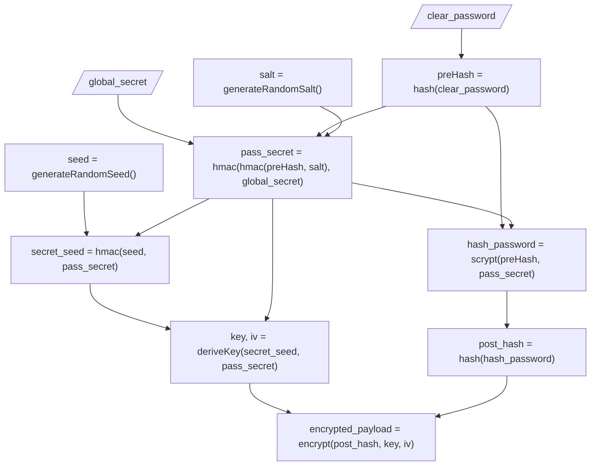

A secure password hashing/encryption library for node and JavaScript.

## Features:

* Pre-hash password
* Use scrypt for anti-paralelization
* Use symmetric encryption for storing the password
* Use global secret (a.k.a. pepper) for extra security
* Algorithms can be replaced by custom ones
* Whole library can be re-implemented 

## Why?

I needed a secure way to store passwords in a database. Following the [best
practices recommended by the
OWASP](https://cheatsheetseries.owasp.org/cheatsheets/Password_Storage_Cheat_Sheet.html),
and using modern algorithms, to avoid common attacks like rainbow tables, brute
force, and dictionary attacks.

## What is the difference between this library and others?

This library is designed to be secure, and to be easy to use.

| Feature                | ExPass    | bcrypt   | scrypt    | hash   | pbkdf2   |
| ---------              | :------:  | :------: | :------:  | :----: | :------: |
| Pre-hash               | ✔️         | ❌       | ❌        | ❌     | ❌       |
| Use salt               | ✔️         | ✔️        | ✔️         | ❌     | ✔️        |
| Use pepper             | ✔️         | ❌       | ❌        | ❌     | ❌       |
| Against rainbow tables | Very High | High     | Very High | Low    | Moderade |
| Against brute force    | Very High | Very High     | Very High      | Low    | Moderade      |
| Against dictionary     | Very High | Very High     | Very High      | Low    | Moderade      |
| Against paralelization | High | Moderade      | High | Low    | Low      |
| Against GPU            | Very High | High     | Very High      | Low    | Low      |

## Why scrypt?

Scrypt is a key derivation function designed to be "memory-hard", but OWASP
recommends use argon2, but scrypt is a good alternative.

Whatever, I decided to use scrypt because it's native to node, agaist argon2

## Encrypting a password

This site documents the concepts, APIs, and usage patterns for both packages.

